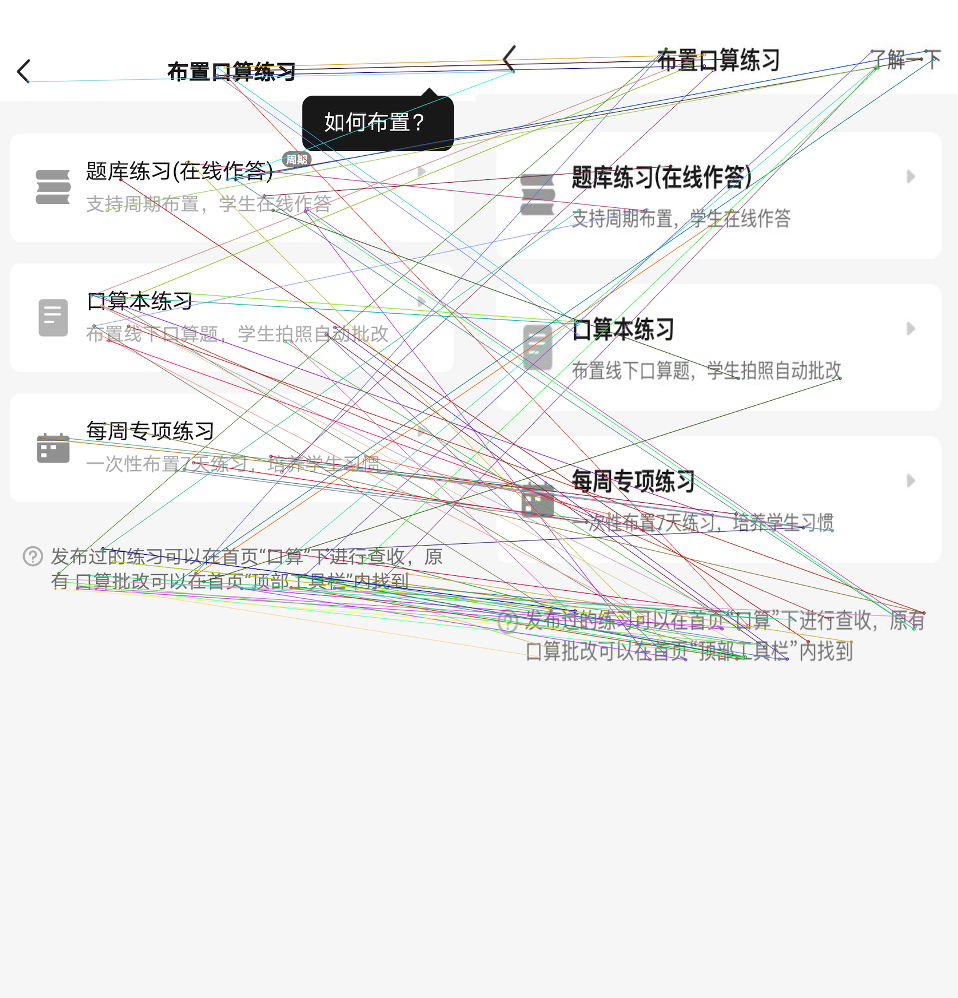
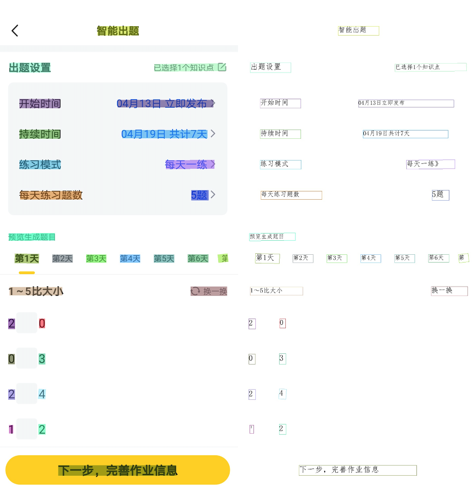

# 安卓IOS页面匹配算法
## 简介
安卓与IOS双端的同一页面无法在不依赖人工添加信息特征的情况下进行绑定, 因此使用图像信息进行匹配。
所使用算法主要有SIFT(尺度不变特征变换)与OCR。其中SIFT进行图像的粗排，以减少搜索空间，OCR技术进行精排，最终给出结果。

## 特性
- 由于进行匹配的图像主要为APP界面截图，多个界面截图具有极高相似性。传统的图像匹配算法(图像哈希[3-5]，孪生神经网络[6]等)在这个任务上效果较差，因此使用图像配准领域的SIFT算法。使用SIFT算法带来了极快的匹配速度，以及针对APP多种情况截图的极强的鲁棒性（多种设备上界面比例的不同，深夜模式的差异，跨版本的差异等）
  
- 由于SIFT算法主要考虑图像结构上的差异性，而未考虑图像中极有价值的文字信息，在结构相似，内容不同的页面之间容易发生误判。因此引入了OCR对这种情况进行处理

## 实现与效果展示
### SIFT
我们所使用的是[Opencv](https://docs.opencv.org/master/)中的SIFT，但在实际的测试中我们发现VLFeat中的SIFT具有更快的性能，以及更好的效果，并且更接近[David Lowe的实现](https://www.cs.ubc.ca/~lowe/keypoints/)[1]我们更建议大家选择VLFeat中的SIFT实现。

注:SIFT算法于2020年3月专利过期，因此仅有一部分版本的opencv能够使用。
### SIFT效果演示

### OCR
我们所使用的OCR框架为百度开源的[PaddleOCR](https://github.com/PaddlePaddle/PaddleOCR)[2],在实际使用中我们建议大家对Detection module在自己的任务中进行独立训练以获得更好的效果。在我们的研究工作中发现只需要对Detection module进行简单的Finetune就能起到良好的效果。我们同样将我们训练过的Detection权重进行了开源，虽然没有在别的APP场景下进行大规模测试，但我们认为他在别的场景下也会有良好鲁棒性。

### OCR效果演示

### 使用 
python ./server.py

数据库字段含义见后端文档
### 参考文献及开源项目
[1] [Lowe, D. G. (2004). Distinctive image features from scale-invariant keypoints. International journal of computer vision, 60(2), 91-110.](https://www.cs.ubc.ca/~lowe/papers/ijcv04.pdf)

[2] [PaddleOCR](https://github.com/PaddlePaddle/PaddleOCR)

[3] [Indyk, P., & Motwani, R. (1998, May). Approximate nearest neighbors: towards removing the curse of dimensionality. In Proceedings of the thirtieth annual ACM symposium on Theory of computing (pp. 604-613).](http://citeseer.ist.psu.edu/viewdoc/download;jsessionid=E62605DC4A964D87F53091BFA7E1A0A4?doi=10.1.1.38.249&rep=rep1&type=pdf)

[4] [Weiss, Y., Torralba, A., & Fergus, R. (2008, December). Spectral hashing. In Nips (Vol. 1, No. 2, p. 4).](http://people.csail.mit.edu/torralba/publications/spectralhashing.pdf)

[5] [Liu, W., Mu, C., Kumar, S., & Chang, S. F. (2014). Discrete graph hashing.](https://proceedings.neurips.cc/paper/2014/file/f63f65b503e22cb970527f23c9ad7db1-Paper.pdf)

[6] [Zagoruyko, S., & Komodakis, N. (2015). Learning to compare image patches via convolutional neural networks. In Proceedings of the IEEE conference on computer vision and pattern recognition (pp. 4353-4361).](https://openaccess.thecvf.com/content_cvpr_2015/papers/Zagoruyko_Learning_to_Compare_2015_CVPR_paper.pdf)

[6] [Learning to Compare Image Patches via Convolutional Neural Network](https://proceedings.neurips.cc/paper/2014/file/f63f65b503e22cb970527f23c9ad7db1-Paper.pdf)
