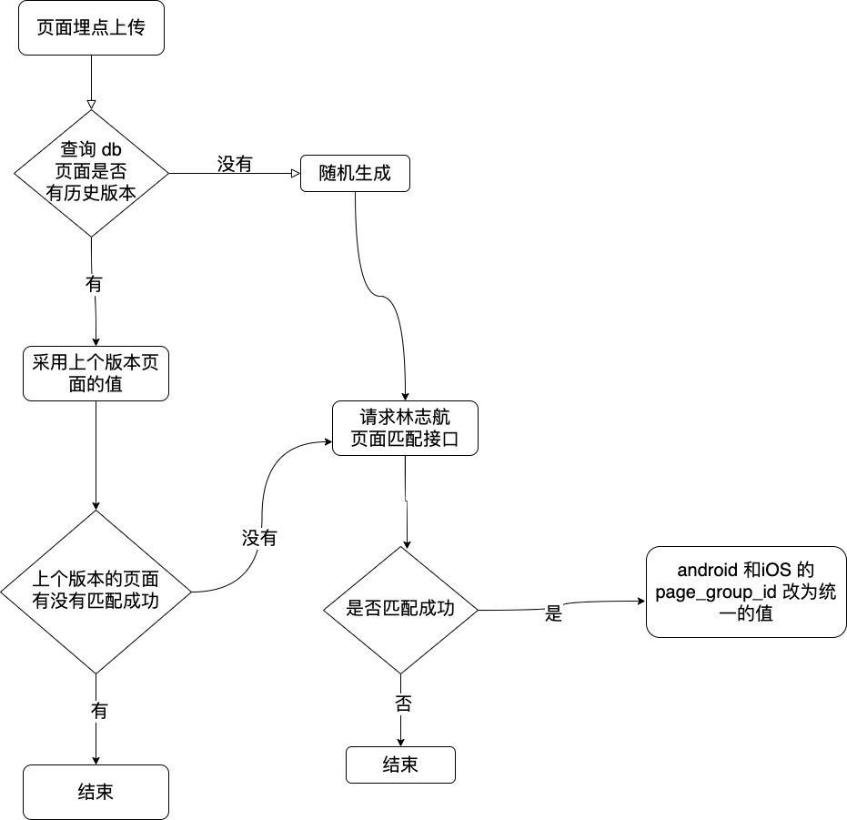
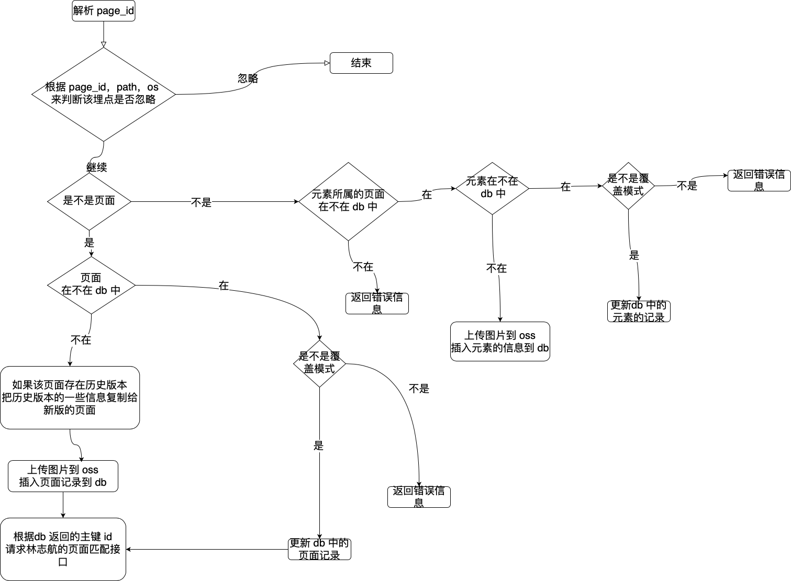
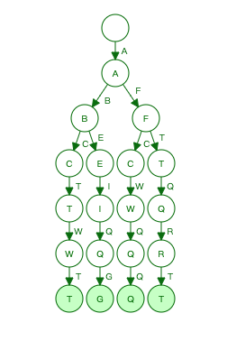

## 基本概念

一个埋点有两部分组成：component_name 和 path

component_name + path 可以确定埋点的唯一性

component_name 和 path 的取值由前端来确定

埋点平台的展示是以页面为基础，一个页面里有很多埋点。

对应到数据库里就是有两种埋点类型：页面埋点和元素埋点。

使用`is_page` 这个字段来作为表示。

一个埋点是页面还是元素( `is_page` ) 由前端上传时决定的。

## page_id

对于页面来说需要一个唯一标识来作为 id，对应到数据库的字段就是`page_id`。

一般来说 `page_id` 的生成规则是把 `component_name` 按照`#`分割

分割后产生数组的第一个元素就是 `page_id`

其实上面说的过程就是从 android 的 `component_name` 中截取 `activity`

从 ios 的`component_name`中截取 `controller`

由于 android 有时两个不同的页面有着相同的 `activity`，所以 `page_id` 还要加上页面的名称(`page_title`)

### 例子

| os | version | component_name | page_id | page_group_id |
|  ----  | ----  | ----  | ----  | ----  |
| android | 1.1.1 | a#b#c | a_title | wefsd |
| android | 1.1.2 | a#b#c | a_title | wefsd |
| iOS | 1.1.1 | p1 | p1_title | wefsd |
| IOS | 1.1.2 | p1 | p1_title | wefsd |

## page_group_id

为了把 android 和 ios 的同一个页面对应在一起，在数据库中使用了`page_group_id` 字段来维护这个关系

同一个页面，不同系统，不同版本之间，`page_group_id` 的值相同

### 例子

| os|version|component_name|page_id|page_group_id |
|  ----  | ----  | ----  | ----  | ----  |
| android|1.1.1|a#b#c|a_title|wefsd |
| android|1.1.2|a#b#c|a_title|wefsd |
| iOS|1.1.1|p1|p1_title|wefsd |
| IOS|1.1.2|p1|p1_title|wefsd |

### page_group_id 生成流程

# 埋点可视化上传

# 添加埋点流程中的细节：

### 如何判断埋点已经存在

- 页面：根据 page_id，version，platform
- 元素：根据 page_id，version，platform，comopent_name，path

### 在覆盖模式下有哪些属性允许覆盖

- 页面：全屏截图
- 元素：埋点名称(`trace_name`)，位置信息(`position`)，全屏截图(`full_picture`)，元素截图(`picture`)

# 页面内埋点树状结构展示

### 过程

1. 通过 `page_id`  查询出页面内所有的埋点
2. 把所有的埋点的 `component_name` 和 `path` 拼接在一起，得到埋点的全路经
3. 把全路经按照 `#`和 `/` 分割，得到元素的每一个节点
4. 把一个埋点的全路径看做一个单词，埋点的一个节点视为一个字母，按照生成前缀树的方式生成埋点的树状结构

### 例子

输入

| component_name|path|full_path |
|  ----  | ----  | ----  | 
| a/b/c|t/w/t|a/b/c/t/w/t |
| a/b/e|i/q/g|a/b/e/i/q/g |
| a/f/t|q/r/t|a/f/t/q/r/t |
| a/f/c|w/q/q|a/f/c/w/q/q |

结果 

### 路径过长的问题

由于 component_name + path 的路径过长，前端展示非常难看。所以需要删减无用的节点。

观察发现：有用的都是叶子节点，但是如果只保留叶子节点，那层级关系就没了。

所以只要保留根节点，叶子节点，分叉节点，和分叉节点的下一个节点就行了。

删除前：

删除后：

